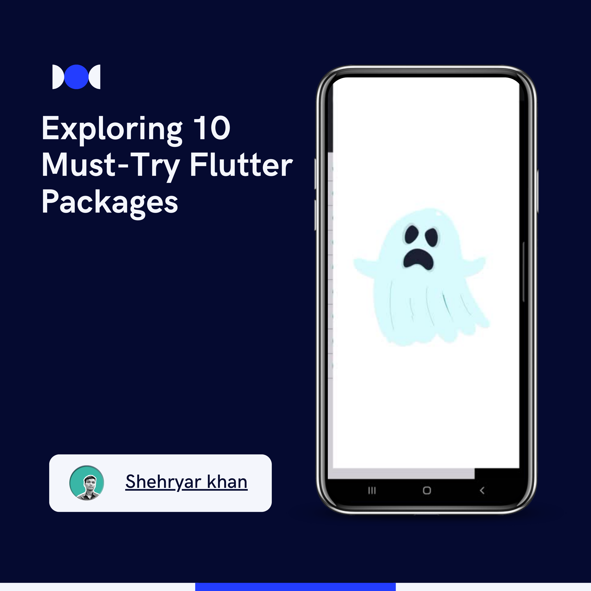

# 📱 Flutter UI & UX Package Exploration

This project explores a variety of Flutter packages to enhance the UI and UX of mobile applications, integrating popular animations, icons, and widgets.

---

## 🌟 Features

1. **Font Awesome Flutter** – Icons for any style
2. **Read More** – Expand/collapse for longer text sections
3. **Badges** – Add notification badges to widgets
4. **Pin Code Fields** – User-friendly pin code input
5. **Animated Text Kit** – Text animations for visual appeal
6. **Liquid Swipe** – Fluid onboarding experience
7. **Introduction Screen** – User intro screens
8. **Animations** – Smooth transitions and built-in effects
9. **Salomon Bottom Bar** – Sleek bottom navigation
10. **Lottie** – Integrate JSON-based animations
11. **Smooth Page Indicator** – Customizable page indicators

---

## 🎥 Demo 
Check out the demo Gif showcasing the app's functionality:  

---

## 📦 Packages Used

| Package                 | Version |
|-------------------------|---------|
| Font Awesome Flutter    | 10.7.0  |
| Read More               | 3.0.0   |
| Badges                  | 3.1.2   |
| Pin Code Fields         | 8.0.1   |
| Animated Text Kit       | 4.2.2   |
| Liquid Swipe            | 3.1.0   |
| Introduction Screen     | 3.1.14  |
| Animations              | 2.0.11  |
| Salomon Bottom Bar      | 3.3.2   |
| Lottie                  | 3.1.3   |
| Smooth Page Indicator   | 1.2.0+3 |

---

## 🚀 Getting Started
Clone the repo: git clone https://github.com/Shehryar-dev/Flutter-Packages.git
1. **Clone the repo**: `git clone https://github.com/Shehryar-dev/Flutter-Packages.git`
2. **Install dependencies**: `flutter pub get`
3. **Run the app**: `flutter run`

---

## 💼 Connect

- **LinkedIn**: [LinkedIn](https://www.linkedin.com/in/shehryarkhandiv)
- **GitHub**: [GitHub](https://github.com/Shehryar-dev)

